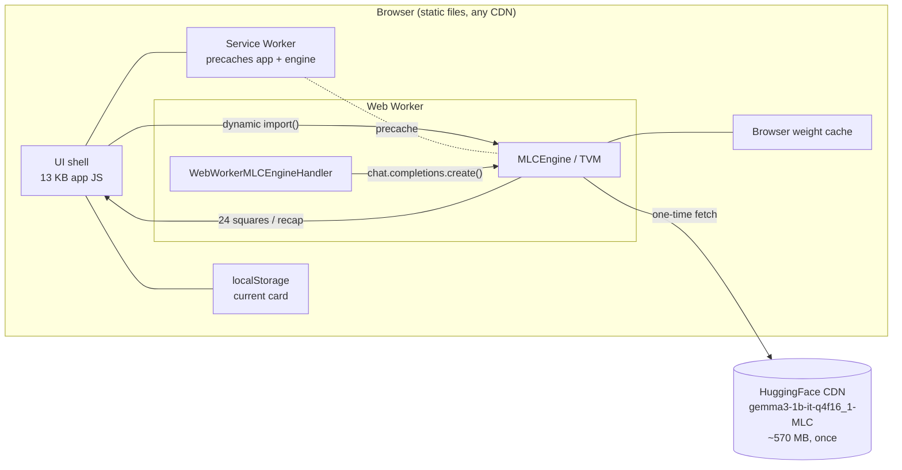

# Touch Grass Bingo: an offline AI walk card that never leaves your browser

> **Status**: draft for the Hacktoberfest Open-Source AI Challenge: Week 1 — Touch Grass
> **Required tag**: `#hf26challenge` · additional tags: `#gemma`, `#webgpu`, `#hacktoberfest`
> **Repo**: https://github.com/hey-nitsuj/Touch-Grass-Bingo · **Live demo**: https://hey-nitsuj.github.io/Touch-Grass-Bingo/

---

Every "AI feature" in a web app today is a round trip: collect input, send it to a hosted
model, stream tokens back. For a game whose whole point is **getting you off the screen**, a
server would have been both a contradiction and a liability — someone else would know where
you walked.

So **Touch Grass Bingo** runs Gemma 3 1B *inside the browser*, via
[WebLLM](https://github.com/mlc-ai/web-llm) and WebGPU. Pick a habitat, a time of day, and an
optional focus ("birds, street art, dogs"). The model writes a 5×5 bingo card of things you
can actually spot in the next 15 minutes. You tap squares on your walk — with zero signal —
and afterwards the same model writes a short field recap of your outing.

No accounts, no API keys, no analytics, no server. After the first visit it works in
airplane mode.

## What it asks for, and what you get



Generation runs in a **Web Worker** so the UI never janks while the model prefills, and the
6 MB engine chunk is **lazy-loaded on first Generate** — the initial page is 13.8 KB of app
code.

## Why open innovation is the whole project, not a footnote

The challenge asks why the open piece matters. For this app it *is* the app:

1. **It runs on a phone in the backcountry with no internet.** Weights are cached after the
   first load; generation, checking, and recaps are all local. A closed API can't promise
   that, and I'd have nothing to demo at mile three of a trail.
2. **Your location data stays off a server you don't control.** The app never sees where you
   are. There is no backend to leak.
3. **It costs nothing to run.** Static hosting, no inference bill, no rate limits.
4. **The model is swappable in one line.** WebLLM ships Llama, Qwen, Phi and more in its
   prebuilt config — change `MODEL_ID` in `src/engine.ts` and the card's personality changes.

## The interesting engineering problem: 1B models are flaky

The fun part wasn't calling an API, it was making a small model reliable enough for a game
that must always produce exactly 24 squares. Defenses, in order:

| Failure mode | Defense |
| --- | --- |
| JSON wrapped in prose or markdown fences | bracket-hunting parser |
| Model answers with a numbered list instead of JSON | line-based fallback parser |
| JSON arrays with trailing commas (Gemma's signature) | salvage quoted strings when strict `JSON.parse` fails |
| Repeated squares across attempts | case-insensitive dedupe |
| Single-word lazy squares (`dog`, `leaf`, `flash`) | bare-noun gate drops them; card tops up from the pad pool, or regenerates |
| Recap falls into a repetition loop (`a *another* dog…`) | `repetition_penalty` + degenerate-output detector + colder retry |
| Fewer than 24 items returned | top-up from a themed pad pool |
| Genuinely bad response | retry with a stricter prompt, then a built-in preset deck |
| No WebGPU / failed worker | preset decks + an honest status chip, never a dead end |

Every path terminates in a playable card. The parser and defense tests live in `tests/extract.test.ts`.

**A detail worth stealing:** before picking the model I checked WebLLM's prebuilt config for
`required_features`. Plenty of popular `q4f16_1` builds declare
`required_features: ["shader-f16"]` and throw `ShaderF16SupportError` on GPUs without that
feature. `gemma3-1b-it-q4f16_1-MLC` (711 MB VRAM, `low_resource_required: true`) does not —
which makes it the right default for a game anyone should be able to open. Another landmine:
Gemma 3's config ships both `context_window_size` and `sliding_window_size` positive, which
WebLLM refuses (`WindowSizeConfigurationError`) — unless you disable one at load time via
`chatOpts: { sliding_window_size: -1 }`. Feature-detecting `navigator.gpu` up front and
falling back to preset decks keeps the promise: the app never dead-ends.

## Getting it running

```bash
git clone https://github.com/hey-nitsuj/Touch-Grass-Bingo
npm install
npm run dev        # local dev
npm run test       # parser tests
npm run build      # typecheck + production build
```

WebGPU needs a secure context — `https://` or `localhost`, nowhere else.

## What I'd do differently

- **Streaming.** Card generation currently resolves as one blob; streaming the 24 squares in
  as they decode would make the wait feel shorter. WebLLM supports it; I chose simplicity
  first.
- **A service worker engine host.** WebLLM can host the engine in a service worker so the
  model survives reloads without a worker respawn. Worth it for a v2.

## Try it, then go outside

The point of the game is that the screen is the shortest part of the experience. Generate a
card, put the phone in your pocket, walk, and come back for the recap.

**Play it live: <https://hey-nitsuj.github.io/Touch-Grass-Bingo/>** — or read the source at
[github.com/hey-nitsuj/Touch-Grass-Bingo](https://github.com/hey-nitsuj/Touch-Grass-Bingo).

Built with WebLLM + Gemma 3 1B (open weights), Vite, and no backend at all. MIT licensed.
