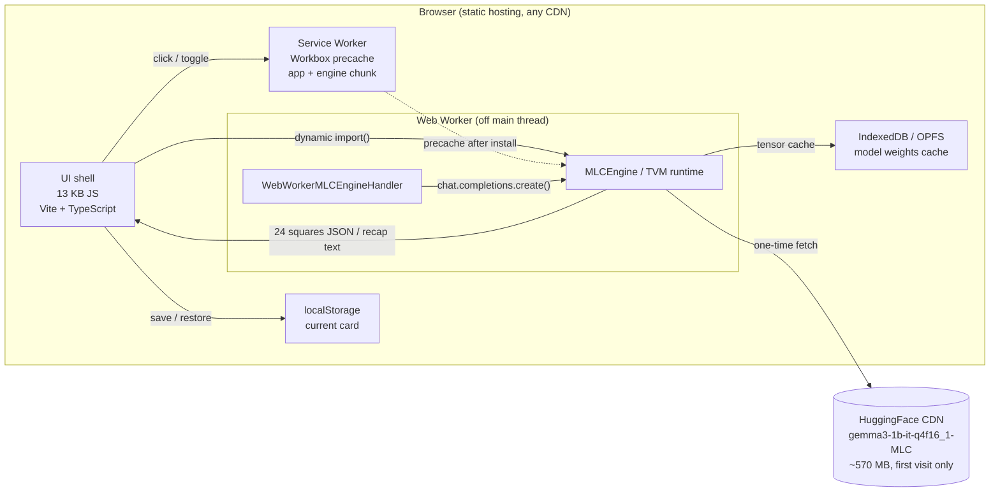
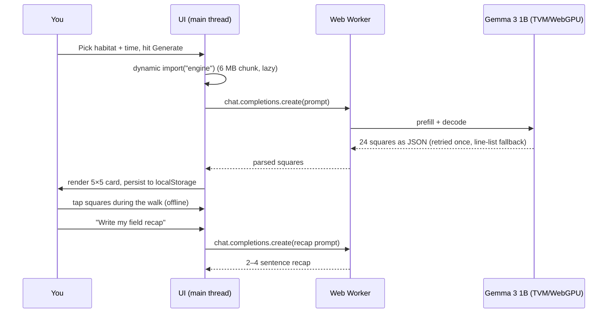

# 🌿 Touch Grass Bingo

**AI-generated bingo cards for your walk — that run entirely on your device.**

Pick a habitat (neighborhood, park, trail, waterfront), a time of day, and an optional focus
("birds, street art, dogs"). A 1-billion parameter **open-weight model (Gemma 3 1B)** loads into
your browser via [WebLLM](https://github.com/mlc-ai/web-llm) and writes a 5×5 bingo card of things
you can actually spot in the next 15 minutes. Check squares as you walk — the card works with **zero
signal** — then let the same model write a short field recap of your outing.

No accounts. No servers. No location data. Airplane-mode friendly after the first visit.

## Why open source is the whole point

This project is exactly what it is because the model is open and local:

- **It runs in the backcountry with no internet.** After the first model download (~570 MB, cached
  by the browser), the entire app — card generation, bingo checking, recaps — works offline. A
  closed API could never make that promise.
- **Your walk stays yours.** No server ever sees where you went or what you noticed. The inference
  happens in a Web Worker on your hardware.
- **It costs nothing to run.** No API bill, no rate limits, no backend to keep alive. The app is a
  static file.
- **The model is swappable.** WebLLM's prebuilt config includes Llama, Qwen, Phi, and more — change
  one constant (`MODEL_ID` in `src/engine.ts`) and the personality of your bingo cards changes.

## Architecture



**Data flow for one card:**



## Local development

```bash
npm install
npm run dev        # dev server
npm run test       # JSON-extraction parser tests
npm run build      # typecheck + production build → dist/
npm run preview    # serve dist/ locally
```

Requires a browser with **WebGPU** (Chrome/Edge 113+, Safari 26+, Firefox on Windows/mac). Without
WebGPU the app falls back to built-in preset decks so it never dead-ends.

## How it handles small-model reality

A 1B model is charming but flaky, so the app defends itself:

| Failure | Defense |
| --- | --- |
| JSON wrapped in prose or markdown fences | bracket-hunting parser |
| Model answers with a numbered list instead of JSON | line-based fallback parser |
| Fewer than 24 items returned | top-up from a themed pad pool |
| Genuinely bad response | one retry at lower temperature, then preset deck |
| No WebGPU / crashed worker | preset decks, honest status chip |

## Tech stack

- **Vite + TypeScript** — no framework, 13 KB of app JS
- **WebLLM** (`@mlc-ai/web-llm`) — in-browser inference, `gemma3-1b-it-q4f16_1-MLC`
- **vite-plugin-pwa** — offline-first service worker, `~12 MB` precache (engine included)
- **Fraunces / Space Grotesk / Caveat** — self-hosted fonts, zero third-party requests

## License

[MIT](./LICENSE)

---

Built for the [Hacktoberfest Open-Source AI Challenge: Week 1 — Touch Grass](https://dev.to/challenges/hf26)!
